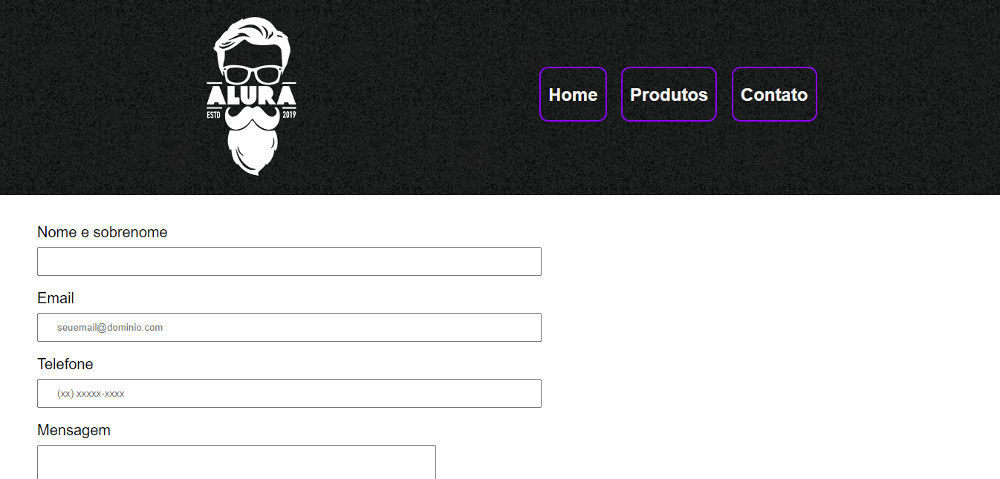

# Barbearia Alura

Página Web de uma barbearia fictícia, onde foi explorado recursos do <b>HTML e CSS</b>.

<h6 align="center"> <a href="https://jean-carlo-torres.github.io/barbearia-alura/index.html"> **Link para testar o projeto **</a> </h6>

<h3>Contribuindo</h3>

⭐️ Star o projeto

🐛 Encontrar e relatar issues